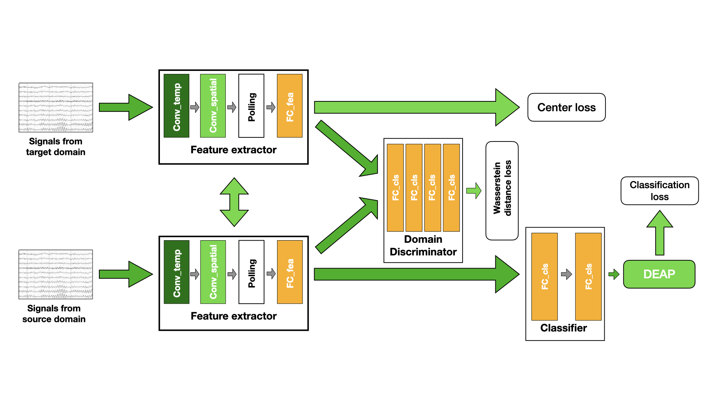

# 2023 한국컴퓨터종합학술대회 [EEG 분류를 위한 와서스테인 거리 손실을 사용한 심층 표현 기반의 도메인 적응 기법]

## Abstract
최근 EEG 신호는 감정 분석, 질병 진단, BCI 등 다양한 분야에 사용되고 있다. 심층 학습이 발전함에 따라 EEG 신호를 딥러닝 모델에 적용하여 분석하는 시도가 늘어나고 있는 가운데, 본 논문에서는 EEG 신호를 와서스테인 거리 손실(Wasserstein distance loss)을 사용한 심층 표현(deep representation) 기반 의 도메인 적응(domain adaptation) 기법을 통한 감정 분류 방법을 제안한다. EEG 신호의 비정상성과 도 메인간 차이로 인한 분류 성능 하락 문제를 해결하기 위해 와서스테인 손실 기법을 적용한다. 이 기법은 소스 도메인과 타겟 도메인 간의 괴리를 줄여 EEG 신호에 대해 더 강건한 모델 학습을 가능하게 한다. 실험 결과와 함께 제안한 방법의 유효성을 증명한다.

## Dataset
뇌파 감정 데이터셋 [DEAP](https://www.eecs.qmul.ac.uk/mmv/datasets/deap) 사용
32개의 채널로 1분의 뮤직 비디오를 시청하여 1-9의 연속된 값으로 감정을 표현하며 동시에 뇌파를 측정

## Model
### Wasserstein-DRDA
EEG MI를 분류하는 [DRDA](https://ieeexplore.ieee.org/document/9154600) 모델의 discriminator를 Wasserstein Loss로 대체한 모델
Source Domain과 Target Domain의 괴리를 줄이는 방향으로 특징 추출기를 학습시켜 Domain Adaptation을 적용

## Result
### Valence (%)
| Model | Accuracy | Precision | Recall | F1 |
|------|------|------|------|------|------|
| DRDA | 42.13 | 25.88 | 42.13 | 28.83 |
| W-DRDA | 41.00 | 35.04 | 41.00 | 36.58 |

### Arousal (%)
| Model | Accuracy | Precision | Recall | F1 |
|------|------|------|------|------|------|
| DRDA | 47.63 | 24.44 | 47.63 | 31.62 |
| W-DRDA | 48.63 | 28.08 | 48.63 | 33.41 |

## 파일 구성

main.sh : Hyperparameter 튜닝을 위한 리눅스 쉘스크립트, 파일 실행을 위해서는 리눅스 기반 환경 구성이 필요.

main.py : 메인 파이썬 코드. 모델 학습을 위해 사용됨

model.py : 모델 파이썬 코드

loadData.py : 데이터 (DEAP)를 불러오고 데이터 전처리를 수행

train_val_model.py : 학습 및 검증, 테스트에 필요한 함수 내장

## 실행 방법
sh main.sh
